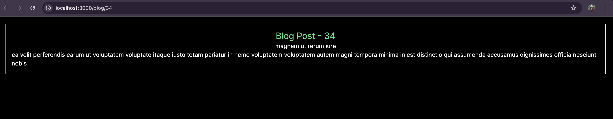

This is a [Next.js](https://nextjs.org/) project bootstrapped with [`create-next-app`](https://github.com/vercel/next.js/tree/canary/packages/create-next-app).

## Getting Started

First, run the development server:

```bash
npm run dev
# or
yarn dev
# or
pnpm dev
# or
bun dev
```

Open [http://localhost:3000](http://localhost:3000) with your browser to see the result.

You can start editing the page by modifying `app/page.js`. The page auto-updates as you edit the file.

This project uses [`next/font`](https://nextjs.org/docs/basic-features/font-optimization) to automatically optimize and load Inter, a custom Google Font.

## Learn More

To learn more about Next.js, take a look at the following resources:

- [Next.js Documentation](https://nextjs.org/docs) - learn about Next.js features and API.
- [Learn Next.js](https://nextjs.org/learn) - an interactive Next.js tutorial.

You can check out [the Next.js GitHub repository](https://github.com/vercel/next.js/) - your feedback and contributions are welcome!

## Deploy on Vercel

The easiest way to deploy your Next.js app is to use the [Vercel Platform](https://vercel.com/new?utm_medium=default-template&filter=next.js&utm_source=create-next-app&utm_campaign=create-next-app-readme) from the creators of Next.js.

Check out our [Next.js deployment documentation](https://nextjs.org/docs/deployment) for more details.


### NOTES - generateStaticParams


In the context of Next.js and the `app` directory structure, `generateStaticParams` plays a crucial role in static generation for dynamic routes. Here’s a breakdown of its purpose and why it might still work even if omitted:


1. **Static Paths Generation:**
   `generateStaticParams` is used to specify which paths should be statically generated at build time. It generates an array of route parameters (like slugs) that Next.js uses to create static pages for each path.

2. **Pre-Generation of Pages:**
   By returning an array of parameters, Next.js knows which pages to pre-render when you build your application. This can be crucial for performance and SEO because it allows pages to be served instantly from the cache without waiting for client-side data fetching.

3. **Building Static Pages:**
   During the build process, Next.js uses the output of `generateStaticParams` to generate HTML files for each route specified. This reduces the need for server-side rendering on request and ensures fast loading times for static content.

### Example Without `generateStaticParams`

Even if you omit `generateStaticParams`, the page might still work if you use a method like server-side rendering or client-side fetching. However, it will not benefit from static generation, and Next.js will not generate static pages for each route in advance.

### Detailed Example

**With `generateStaticParams`:**

```javascript
// app/blog/[slug]/page.js

import React from 'react';

// Server Component
const BlogPost = async ({ params }) => {
  const { slug } = params;
  const res = await fetch(`https://jsonplaceholder.typicode.com/posts/${slug}`, {
    cache: 'no-store',
  });
  const post = await res.json();

  return (
   <div className='flex flex-col justify-center items-center p-4 m-5 border border-gray-300'>
      <h1 className='text-2xl text-green-400'>Blog Post - {slug}</h1>
      <h1>{post.title}</h1>
      <p>{post.body}</p>
    </div>
  );
};

export default BlogPost;

// Generate static paths
export async function generateStaticParams() {
  const res = await fetch('https://jsonplaceholder.typicode.com/posts');
  const posts = await res.json();

  return posts.map((post) => ({
    slug: post.id.toString(),
  }));
}
```

- **Build Time:** Static pages for each slug are generated at build time based on the data fetched in `generateStaticParams`.
- **Performance:** Pages are pre-rendered, improving performance and SEO.

**Without `generateStaticParams`:**

```javascript
// app/blog/[slug]/page.js

import React from 'react';

const BlogPost = async ({ params }) => {
  const { slug } = params;
  const res = await fetch(`https://jsonplaceholder.typicode.com/posts/${slug}`, {
    cache: 'no-store',
  });
  const post = await res.json();

  return (
    <div className='flex flex-col justify-center items-center p-4 m-5 border border-gray-300'>
      <h1 className='text-2xl text-green-400'>Blog Post - {slug}</h1>
      <h1>{post.title}</h1>
      <p>{post.body}</p>
    </div>
  );
};

export default BlogPost;
```

- **Request Time:** Each page request will trigger a server-side fetch to get the post data.
- **Performance:** Each page request involves a server-side fetch, which could be slower compared to pre-generated static pages.

### Summary

- **Purpose:** `generateStaticParams` is used to pre-generate static pages for dynamic routes at build time.
- **Without It:** The page will still work, but it won’t benefit from static generation. Instead, it may rely on server-side rendering or client-side fetching, which can impact performance and SEO.
- **Best Practice:** Use `generateStaticParams` to leverage static generation for better performance and SEO, especially for pages with dynamic routes.

- **Question** - but here where this function is used it is just declared and not used anywhere ?
You’re right. In the example, generateStaticParams is declared but not explicitly used in the file. This might be confusing because Next.js handles it internally.

1. **How `generateStaticParams` is Used**
In Next.js, particularly in the app directory with the new routing features, `generateStaticParams` is automatically recognized by the framework to generate static paths. Here's how it fits into the process:

2. **Automatic Usage by Next.js:**
Next.js looks for functions like `generateStaticParams` when building your application. When you use dynamic routes, Next.js uses these functions to pre-generate static paths based on the parameters provided.

3. **Static Generation:**
During the build process, Next.js automatically calls `generateStaticParams` to determine which dynamic routes need to be statically generated. It doesn’t need to be called directly in your code.

4. **Routing Configuration:**
Next.js uses the data returned by `generateStaticParams` to configure static pages for dynamic routes. The function itself doesn’t need to be invoked manually within your components.




generateStaticParams: For pages with dynamic routes, this function is called during the build process to fetch parameters and generate static HTML pages.
Example: In /app/blog/[slug]/page.js, generateStaticParams provides a list of slugs to generate static pages for each blog post at build time.
THIS WILL IMPROVE THE SEO

## IMP - while building itself it saves the possible static pages, there by it statically generate routes at build time instead of on-demand at request time